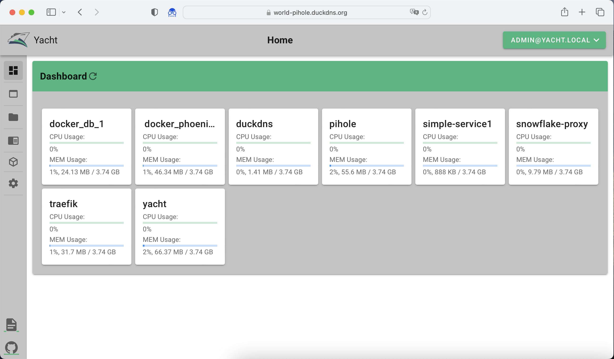

   * Public URL's: forward to an external host running Kubernetes/Ingress https://github.com/rogeriomm/labtools-k8s
      * https://world-zeppelin.duckdns.org
      * https://world-jupyter.duckdns.org/jupyter

   * Public URL's: forward to a local Docker container
      * https://world-dashboard.duckdns.org/whoami
         * https://github.com/traefik/whoami
      * https://world-dashboard.duckdns.org/traefik
      * https://world-pihole.duckdns.org
         * [Docker container management yacht](https://yacht.sh)
         * 
      
   * TODO
      * mTLS + Traefik to improve security
         * [Traefik services TLS autentication](https://doc.traefik.io/traefik/routing/services/#certificates)
         * [TLS mutual authentication](https://en.wikipedia.org/wiki/Mutual_authentication#mTLS)
      * Upgrade from Raspberry PI 4 to [Orange Pi 5](http://www.orangepi.org/html/hardWare/computerAndMicrocontrollers/details/Orange-Pi-5.html)
         * ARM V7->V8 64 bits
            * Support for hardware-accelerated crypto AES on ARMv8: improves reverse proxy https TLS encryption speed

